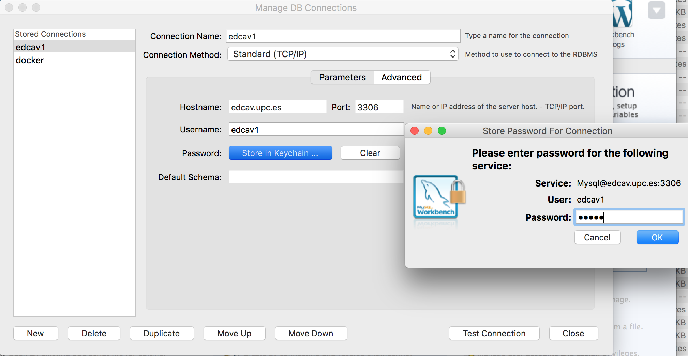

# Session 1. SQL and Multimedia Metadata Hands-on (2 hours)

## 1.	Introduction

This session provides an introduction to (Relational) Database Management Systems (RDBMS), particularly MySQL, and demonstrates their usage for storing and retrieving multimedia metadata. 

## 2.	Environment settings

In order to be able to perform the different tasks you should:

- Boot the PC with the Linux image (preferable) or Windows 
- Log in with the user/password that you use for Atenea (or, in case it does not work, with (invitado, invitado) on Linux or (A2S105-??\invitado, without password) on Windows)

## 3.	Accessing the EDCAV’s MySQL server

At edcav.upc.es we have installed an MySQL Community Server that we will use in this lab session. In order to interact with the server execute the MySQL Workbench application: (Linux) Click the launcher (top-left corner of the screen) and select ‘workbench’. (Windows) Start menu, MySQL folder. 

Click the "New Connection" option and specify the connection parameters. We have created 15 databases named edcav1, edcav2, etc. and 15 users named edcav1, edcav2, etc. with privileges over the respective DBs and password ‘edcav’ for all of them. Ask to the professor wich DB you should use. Then specify the proper parameters, e.g.:

(NOTE: the MySQL Community Server at edcav.upc.es only can be accessed from UPC IP addresses. In case you want to work from your own computer the ANNEX 1 describes some alternatives.)

### 3.1. How to change your password

Within a query window of the MySQL Workbench (the one that appears after connecting to the server) type the following (replace the X for your DB number) and press the execute icon:

	SET PASSWORD FOR ‘edcavX’ = PASSWORD (‘mypassword’);

## 4. Selecting the database to work with

Before start issuing SQL commands, you need to select a database. From a query window of the MySQL Workbench type (replacing X for your database number):

	USER edcavX;

## 5. Creating tables, first examples

The first thing you must do is creating the tables that comprise your database. The creation and destruction of tables is done via the SQL CREATE and DROP commands. For example, if we want to create the table:

*users(__username__, password, email UNIQUE)*

We have to execute:

	CREATE TABLE  users(
		username VARCHAR(100),
		password VARCHAR(100),
		email VARCHAR(100),
		PRIMARY KEY (username),
		UNIQUE (email)
	) ENGINE = INNODB;

*The PRIMARY KEY enforces that the field username contains unique and not null values. We also specify a UNIQUE for the email field as we want it to be an alternate key.*

It is convenient to save all the CREATEs that we use to build our database in order to be able to re-create it if necessary. **Copy the previous CREATE command into a text file named creates.sql** (you can edit it with any text editor).  

You can list the tables in your database with:

	SHOW TABLES;

And get details about a table with:

	DESC users;

Now create the table:

*photos(__filename__, title, description, width, height, datetime_taken, latitude, longitude, username NOT NULL)*
- username ->foreign key: users(username)

Into the same file, below the ‘users’ CREATE, copy the following:

	CREATE TABLE  photos (
		filename VARCHAR(100),
		title VARCHAR(100),
		description VARCHAR(300),
		width INTEGER,
		height INTEGER,
		datetime_taken DATETIME,
		latitude DECIMAL (10,8),
		longitude DECIMAL (10,8),
		username VARCHAR(100) NOT NULL,
		PRIMARY KEY (filename),
		CONSTRAINT photo_fk_1 FOREIGN KEY (username) REFERENCES users(username) ON DELETE CASCADE
	) ENGINE = INNODB;

*The FOREIGN KEY enforces that the field username references an existing row in the users table. If you get the error 150 that means that the definition of the FOREIGN KEY is wrong (e.g. the referenced table and/or the referenced field does not exist.*

Now copy the photos' CREATE command below the users' CREATE command in your creates.sql file. Note that the order in which CREATEs appear is important because 'photos' references 'users'.

### Adding DROP commands to your creates.sql file

If you want to perform changes in the definition of a table you will need to delete the table before issuing a new CREATE command. For instance:

	DROP TABLE photos;

Usually, it is convenient to include DROPs for all the tables at the beginning of your creates.sql file. This way, if you make changes to your CREATEs, you can execute all the contents of the creates.sql to re-create the entire database even if the tables already exist. At the beginning of the creates.sql file (before the CREATEs) copy the following (the order is important, because MySQL is not going to leave us to delete a referenced table):

	DROP TABLE IF EXISTS photos;
	DROP TABLE IF EXISTS users;

*Notice that the order of the DROPs is inverse with respect to the order to the CREATEs.*

## 6. Creating a DB, now your turn 	

Now, create yourself the following tables:

*follows(__follower_username__, __following_username__)*
- follower_username ->foreign key: users(username)
- following_username ->foreign key: users(username)

*likes(__username__, __filename__)*
- username ->foreign key: users(username)
- filename ->foreign key: photos(filename)

Add the resulting CREATEs, and their corresponding DROPs, to your creates.sql file.

## 7. Inserting values and checking constraints

Now your DB has tables, but they still do not contain any row. The SQL command for inserting values is INSERT. For instance:

	SET SQL_SAFE_UPDATES=0;

	DELETE FROM users;
	INSERT INTO users VALUES ("user1", "1234", "user1@gmail.com");

If your CREATEs were correctly specified, there are some INSERTs that MySQL will not let you execute. Check that the following INSERTs raise errors (you don't need to deliver nothing about this):

	INSERT INTO users VALUES ( NULL, "4444", "user2@gmail.com");
	INSERT INTO users VALUES ( "user1", "4444", "user2@gmail.com");
	INSERT INTO users VALUES ( "user2", "4444", "user1@gmail.com");
	INSERT INTO photos VALUES ("photo1.jpg", "photo 1", "winter landscape 1", 600, 400, '2019-02-02 10:10:10', 20.2, 20.2, NULL);
	INSERT INTO photos VALUES ("photo1.jpg", "photo 1", "winter landscape 1", 600, 400, '2019-02-02 10:10:10', 20.2, 20.2, "user2");

## 8. Filling your tables

**Edit a new text file named inserts.sql** and add there the necessary INSERTs and DELETEs to fill the tables with the following values (execute the commands when finished):

Users:
	"user1", "1234", "user1@gmail.com"
	"user2", "1234", "user2@gmail.com"
	"user3", "1234", "user3@gmail.com"

Photos:
	"photo1.jpg", "photo 1", "winter landscape 1", 600, 400, '2019-02-02 10:10:10', 20.2, 20.2, "user1"
	"photo2.jpg", "photo 2", "winter landscape 1", 600, 400, '2019-02-02 10:10:10', 20.2, 20.2, "user1"
	"photo3.jpg", "photo 3", "winter landscape 1", 600, 400, '2019-02-02 10:10:10', 20.2, 20.2, "user2"

Likes:
	"user2", "photo1.jpg"
	"user2", "photo2.jpg"

Follows:

	"user2", "user1"

You should follow these rules:

- You have to respect the specified table constraints
- Datetime values have the format: 'YYYY-MM-DD HH:MM:SS' (with the quotes)
- Order in which you insert rows matters (you cannot reference a user that still does not exist)

### Alernative INSERT syntax

By the way, there's an alternative syntax for INSERTs that you can try:

	INSERT INTO table_name (column1,column2,column3,...) VALUES (value1,value2,value3,...);

### About foreign key errors (errno = 105)

If you find foreign key errors you can get more information with SHOW ENGINE INNODB STATUS; However, you need certain privileges to do that (you have them on your local MySQL but not on the EDCAV server). If you cannot find the way to solve the problem you may ask the lab teacher (she/he have the enough privileges to execute that query).

## 9. SQL Queries
Now that you have tables and rows you can execute the SQL query commands you have learned during the theory classes. Try executing the following queries (you don't need to deliver nothing about this):

1. Show all users and their data

	SELECT * FROM users;

2. (projection) Show the username and password of all users

	SELECT username, password FROM users;

3. (selection) Show the photos with width > 200 and height > 200

	SELECT * FROM photos WHERE width > 200 AND height > 200;

4. (cartesian product) Show all the possible pairs of (photo, user) regardless of the values of the username field (show only the photo's filename and the user's username).

	SELECT p.filename, u.email FROM photos p, users u;

5. (join) For all photos, show their filename and the email address of the user that created them.

	SELECT p.filename, u.email FROM photos p, users u WHERE p.username = u.username;

6. (aggregate functions) Show how many photos belong to "user1".

	SELECT count(*) FROM photos WHERE username = "user1";

7. (grouping) For each user, show the username and how many photos does she has.

	SELECT username, count(*) FROM photos GROUP BY username;

Now, try yourself specifying the SQL statement that will allow you to obtain the following results. **Write your answers in a text file (queries.sql)** that you will deliver to the professor.

1. Show all photos and their data

2. (projection) Show the filename and title of all photos

3. (selection) Show the users with password = "1234"

5. (join between likes and photos) For all the 'likes', show username, the filename and the title of the related photo.

6. (aggregate functions) Show how many likes does "photo1.jpg" have.

## 10.	Delivery

The files creates.sql, inserts.sql and queries.sql have to be delivered in a single file (.zip or .tar.gz) through the proper section within http://atenea.upc.edu. 

## ANNEX 1.	Alternative setups

### A1.1 (A2S105 PCs + local MySQL server) Accessing a local MySQL server from A2S105 PCs

In case that you cannot access the EDCAV’s server you may connect to a MySQL server running on localhost: DB: edcav, user: edcav and password: edcav.

### A1.2 (your own computer + edcav.upc.es server) Accessing the server through a VPN

The MySQL Community Server at edcav.upc.es only can be accessed from UPC IP addresses. In order to access it from your own laptop you can stablish a VPN following the steps [here](https://telecos.upc.edu/ca/els-serveis/serveis-informatics/acces/connexio-vpn).

(WARNING: It seems that the current information provided by ETSETB is wrong for OSX)

(WARNING: The latest version of MySQL Workbench is not compatible with the course server, you need to download version 5.2.47 or older from [here](https://dev.mysql.com/downloads/workbench/))

### A1.3 (your own computer + local MySQL server) Working with Docker

If you want to work with your personal computer and a local MySQL server, but you don't want to mess up your OS, you may find convenient to work over Docker. You need first to install Docker in your machine. In Ubuntu you can do it this way:

    sudo apt-get update
    wget -qO- https://get.docker.com/ | sh
    sudo usermod -aG docker $(whoami)

It's necessary to LOGOUT to let the usermod command have effect.

Windows and OSX installation procedures can be found [here](https://docs.docker.com/install/).

Once you have Docker up and running you can pull and run an msql-server image:

	docker pull mysql/mysql-server:latest
	docker run --name=drcav1 -d -p 3306:3306 mysql/mysql-server:latest

In order to know which root password was given do:

	docker logs drcav1 

And take notice of the root password. Then execute:

	docker exec -it drcav1 mysql -uroot -p

And type:

	mysql>ALTER USER 'root'@'localhost' IDENTIFIED BY 'edcav';
	mysql>CREATE DATABASE IF NOT EXISTS edcav1;
	mysql>CREATE USER 'edcav1'@'%' IDENTIFIED BY 'edcav';
	mysql>GRANT ALL PRIVILEGES ON edcav1.* to 'edcav1'@'%';
	mysql>exit;

Then you can run MySQL Workbench and connect to the server:

(WARNING: Don't try to use the old MySQL Workbench version, e.g. 5.2.47, with the mysql Docker container, it's not going to work.)

