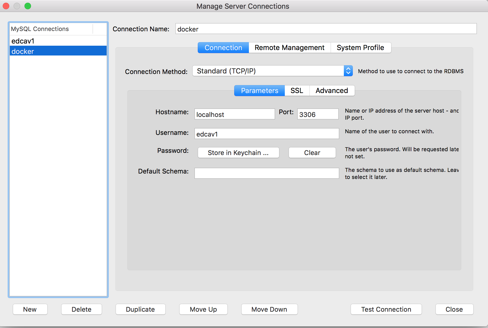

# Session 1. SQL and Multimedia Metadata (2 hours)

## 1.	Introduction

This session provides an introduction to (Relational) Database Management Systems (RDBMS), particularly MySQL, and demonstrates their usage for storing and retrieving multimedia metadata. 

### 1.1	MySQL

MySQL is a [relational database management system (RDBMS)](https://en.wikipedia.org/wiki/Relational_database#RDBMS), a software that enables users manage [relational databases](https://en.wikipedia.org/wiki/Relational_database#RDBMS) and query them with the [SQL](https://en.wikipedia.org/wiki/SQL) language. A relational database is organized into relations (tables), tuples (rows) and attributes (columns). 

## 2. Setup

Read [this](../yourmachine.md) to setup your computer first.

### 2.1 Install MySQL Workbench

Install MySQL Workbench from [here](https://www.mysql.com/products/workbench/).

### 2.2 Install and launch a MySQL server

Install a MySQL server following [this instructions](https://dev.mysql.com/doc/mysql-installation-excerpt/8.0/en/).  

*NOTE: See ANNEX 1 if you want to launch MySQL server from a Docker container*

### 2.3 Create a non-root user and a database

By default you cannot access the server with the root user using MySQL Workbench. So you need to perform the following step using the command-line client. 

Execute in the terminal:

	mysql -u root -p

Once you see the client's "mysql>" prompt type:

	mysql>ALTER USER 'root'@'localhost' IDENTIFIED BY 'drcav';
	mysql>CREATE DATABASE IF NOT EXISTS drcav;
	mysql>CREATE USER 'drcav'@'%' IDENTIFIED BY 'drcav';
	mysql>GRANT ALL PRIVILEGES ON drcav.* to 'drcav'@'%';
	mysql>exit;

## 3. Connecting to a MySQL server

In order to interact with the server, execute the MySQL Workbench application.

Click the "+" option (new connection) and specify the connection parameters: 

* host: 127.0.0.1
* port: 3306 (default∫)
* user: drcav
* password: drcav
* schema: (leave it blank)

## 4. Selecting the database to work with

Before start issuing SQL commands, you need to select a database. From a query window of the MySQL Workbench type:

	USE drcav;

## 5. Creating tables, first examples

The first thing you must do is creating the tables that comprise your database. The creation and destruction of tables is done via the SQL CREATE and DROP commands. For example, if we want to create the table:

*users(__username__, password, email UNIQUE)*

We have to execute:

	CREATE TABLE  users(
		username VARCHAR(100),
		password VARCHAR(100),
		email VARCHAR(100) UNIQUE,
		PRIMARY KEY (username),
		UNIQUE (email)
	) ENGINE = INNODB;

*The PRIMARY KEY enforces that the field username contains unique and not null values. We also specify a UNIQUE for the email field as we want it to be an alternate key.*

It is convenient to save all the CREATEs that we use to build our database in order to be able to re-create it if necessary. **Copy the previous CREATE command into a text file named creates.sql** (you can edit it with any text editor).  

You can list the tables in your database with:

	SHOW TABLES;

And get details about a table with:

	DESC users;

Now create the table:

*photos(__filename__, title, description, width, height, datetime_taken, latitude, longitude, username NOT NULL)*
- username ->foreign key: users(username)

Into the same file, below the ‘users’ CREATE, copy the following:

	CREATE TABLE  photos (
		filename VARCHAR(100),
		title VARCHAR(100),
		description VARCHAR(300),
		width INTEGER,
		height INTEGER,
		datetime_taken DATETIME,
		latitude DECIMAL (10,8),
		longitude DECIMAL (10,8),
		username VARCHAR(100),
		PRIMARY KEY (filename),
		CONSTRAINT photo_fk_1 FOREIGN KEY (username) REFERENCES users(username) ON DELETE CASCADE
	) ENGINE = INNODB;

*The FOREIGN KEY enforces that the field username references an existing row in the users table. If you get the error 150 that means that the definition of the FOREIGN KEY is wrong (e.g. the referenced table and/or the referenced field does not exist.*

Now copy the photos' CREATE command below the users' CREATE command in your creates.sql file. Note that the order in which CREATEs appear is important because 'photos' references 'users'.

### Adding DROP commands to your creates.sql file

If you want to perform changes in the definition of a table you will need to delete the table before issuing a new CREATE command. For instance:

	DROP TABLE photos;

Usually, it is convenient to include DROPs for all the tables at the beginning of your creates.sql file. This way, if you make changes to your CREATEs, you can execute all the contents of the creates.sql to re-create the entire database even if the tables already exist. At the beginning of the creates.sql file (before the CREATEs) copy the following (the order is important, because MySQL is not going to leave us to delete a referenced table):

	DROP TABLE IF EXISTS photos;
	DROP TABLE IF EXISTS users;

*Notice that the order of the DROPs is inverse with respect to the order to the CREATEs.*

## 6. Creating a DB, now your turn 	(**3 points**)

Now, create yourself the following tables:

*follows(__follower_username__, __following_username__)*
- follower_username ->foreign key: users(username)
- following_username ->foreign key: users(username)

*likes(__username__, __filename__)*
- username ->foreign key: users(username)
- filename ->foreign key: photos(filename)

Add the resulting CREATEs, and their corresponding DROPs, to your creates.sql file.

## 7. Inserting values and checking constraints

Now your DB has tables, but they still do not contain any row. The SQL command for inserting values is INSERT. For instance:

	SET SQL_SAFE_UPDATES=0;

	DELETE FROM users;
	INSERT INTO users VALUES ("user1", "1234", "user1@gmail.com");

If your CREATEs were correctly specified, there are some INSERTs that MySQL will not let you execute. Check that the following INSERTs raise errors (you don't need to deliver nothing about this):

	INSERT INTO users VALUES ( NULL, "4444", "user2@gmail.com");
	INSERT INTO users VALUES ( "user1", "4444", "user2@gmail.com");
	INSERT INTO users VALUES ( "user2", "4444", "user1@gmail.com");
	INSERT INTO photos VALUES ("photo1.jpg", "photo 1", "winter landscape 1", 600, 400, '2019-02-02 10:10:10', 20.2, 20.2, "user2");

## 8. Filling your tables (**3 points**)

**Edit a new text file named inserts.sql** and add there the necessary INSERTs and DELETEs to fill the tables with the following values (execute the commands when finished):

Users:

	"user1", "1234", "user1@gmail.com"
	"user2", "1234", "user2@gmail.com"
	"user3", "1234", "user3@gmail.com"

Photos:

	"photo1.jpg", "photo 1", "winter landscape 1", 600, 400, '2019-02-02 10:10:10', 20.2, 20.2, "user1"
	"photo2.jpg", "photo 2", "winter landscape 2", 600, 400, '2019-02-02 10:10:10', 20.2, 20.2, "user1"
	"photo3.jpg", "photo 3", "winter landscape 3", 600, 400, '2019-02-02 10:10:10', 20.2, 20.2, "user2"
	"photo4.jpg", "photo 4", "winter landscape 4", 600, 400, '2019-02-02 10:10:10', 20.2, 20.2, NULL

Likes:

	"user2", "photo1.jpg"
	"user2", "photo2.jpg"

Follows:

	"user2", "user1"

You should follow these rules:

- You have to respect the specified table constraints
- Datetime values have the format: 'YYYY-MM-DD HH:MM:SS' (with the quotes)
- Order in which you insert rows matters (you cannot reference a user that still does not exist)

### Alernative INSERT syntax

By the way, there's an alternative syntax for INSERTs that you can try:

	INSERT INTO table_name (column1,column2,column3,...) VALUES (value1,value2,value3,...);

### About foreign key errors (errno = 105)

If you find foreign key errors you can get more information with SHOW ENGINE INNODB STATUS; However, you need certain privileges to do that (you have them on your local MySQL but not on the drcav server). If you cannot find the way to solve the problem you may ask the lab teacher (she/he have the enough privileges to execute that query).

## 9. Basic SQL queries
Now that you have tables and rows you can execute the SQL query commands that you have learned during the theory classes. Try executing the following queries (you don't need to deliver nothing about this):

1. Show all users and their data

		SELECT * FROM users;

2. (projection) Show the username and password of all users

		SELECT username, password FROM users;

3. (selection) Show the photos with width > 200 and height > 200

		SELECT * FROM photos WHERE width > 200 AND height > 200;

4. (cartesian product) Show all the possible pairs of (photo, user) regardless of the values of the username field (show only the photo's filename and the user's username).

		SELECT p.filename, u.email FROM photos p, users u;

5. (join) For all photos, show their filename and the email address of the user that created them.

		SELECT p.filename, u.email FROM photos p, users u WHERE p.username = u.username;

6. (aggregate functions) Show how many photos belong to "user1".

		SELECT count(*) FROM photos WHERE username = "user1";

7. (grouping) For each user, show the username and how many photos does she has.

		SELECT username, count(*) FROM photos GROUP BY username;

## 10. Basic SQL queries, now your turn (**2 points**)

Now, try yourself specifying the SQL statement that will allow you to obtain the following results. **Write your answers in a text file (queries.sql)** that you will deliver to the professor.

1. Show all photos and their data

2. (projection) Show the filename and title of all photos

3. (selection) Show the users with password = "1234"

4. (join between likes and photos) For all the 'likes' show the username, and the filename and title of the related photo.

5. (aggregate functions) Show how many likes does "photo1.jpg" have.

## 11. More advanced SQL queries

Try executing the following queries (you don't need to deliver nothing about this).

### LIKE 

The LIKE clause allows you to express wildcards (%) in conditions over text fields:

	SELECT * FROM photos WHERE description LIKE "%landscape%";

### HAVING

When we want to perform a GROUP BY but returning only the groups that satisfy a given condition we can use the HAVING clause. For instance the following query retrieves the username of users with more than one photo:

	SELECT username FROM photos GROUP BY username HAVING count(*) > 1;

### NULLs

Try executing the following query:

	SELECT * FROM photos WHERE username != "john";

The photo with username=NULL is not returned as the expression NULL != "john" returns UNKNOWN. But you can do:

	SELECT * FROM photos WHERE username != "john" OR username is NULL;

### LEFT OUTER JOIN

Let's try executing the following query with a JOIN:

	SELECT p.filename, u.email FROM photos p, users u WHERE p.username = u.username;

The photo with username=NULL is not returned. But, why if we want to retrieve information about all the photos even if they are not linked to any username? We can perform a LEFT OUTER JOIN:

	SELECT p.filename, u.email FROM photos p LEFT OUTER JOIN users u ON p.username = u.username;

## 12. More advanced SQL queries, now your turn (**2 points**)
Now, try yourself specifying the SQL statement that will allow you to obtain the following results. **Write your answers in queries.sql**:

1. (LIKE) Show all users with a gmail email address

2. (HAVING) Show all photos with more than zero likes

3. (NULLs) Show all the photos whose username is NULL

4. (LEFT OUTER JOIN) Show the filename of all the photos and, if they are linked to a username, show the corresponding username and password. 

## 13.	Delivery

The files creates.sql, inserts.sql and queries.sql have to be delivered in a single file (.zip or .tar.gz) through the proper section within http://atenea.upc.edu. 

## ANNEX 1.	Alternative setup with Docker

### Install and launch a MySQL server

If you have Docker you can just pull and run an msql-server image:

	docker pull mysql/mysql-server:latest
	docker run --name=drcav -d -p 3306:3306 mysql/mysql-server:latest

In order to know which root password was given do (wait some seconds before):

	docker logs drcav 

And take notice of the root password. 

### Create a non-root user and a database

Let's execute:

	docker exec -it drcav mysql -uroot -p

Once you see the client's "mysql>" prompt type:

	mysql>ALTER USER 'root'@'localhost' IDENTIFIED BY 'drcav';
	mysql>CREATE DATABASE IF NOT EXISTS drcav;
	mysql>CREATE USER 'drcav'@'%' IDENTIFIED BY 'drcav';
	mysql>GRANT ALL PRIVILEGES ON drcav.* to 'drcav'@'%';
	mysql>exit;

### Connect with MySQL Workbench

Launch MySQL Workbench and connect to the server:

